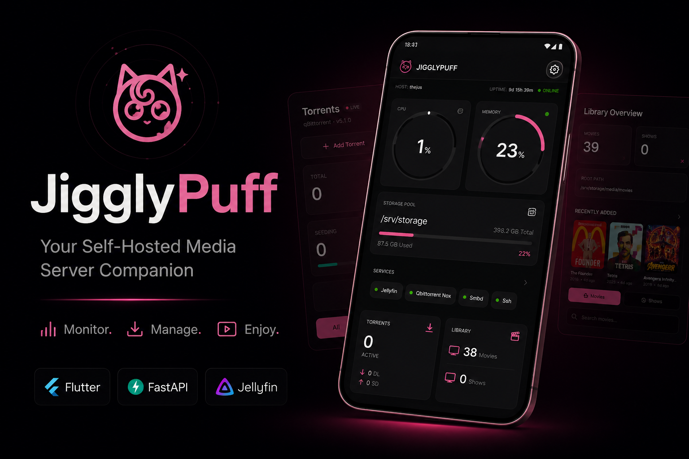
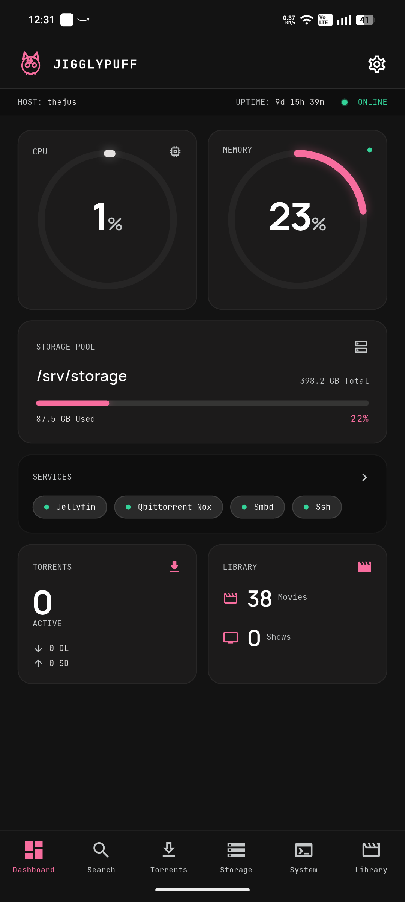
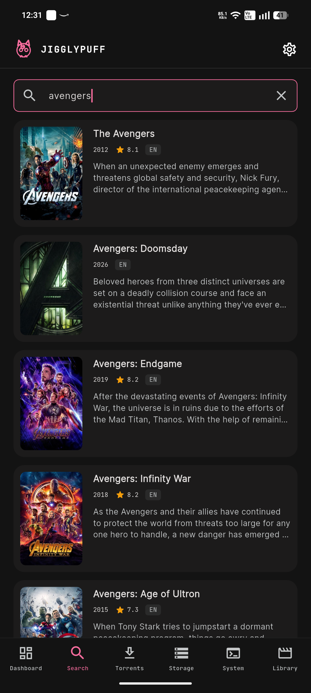
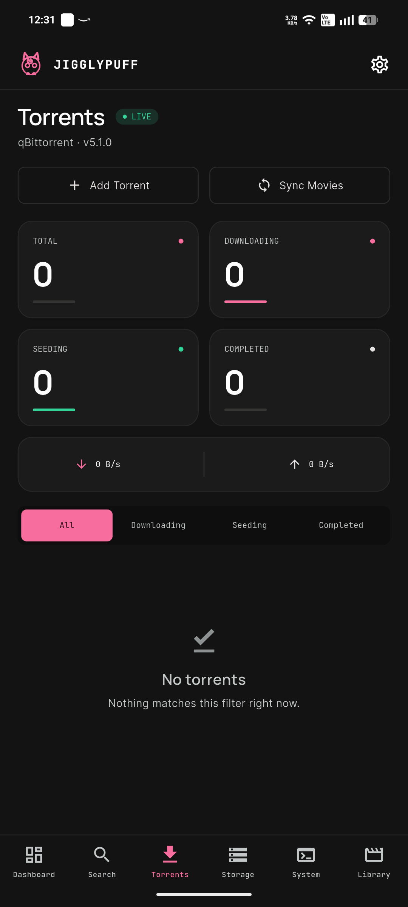
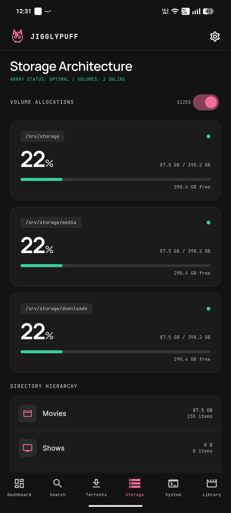
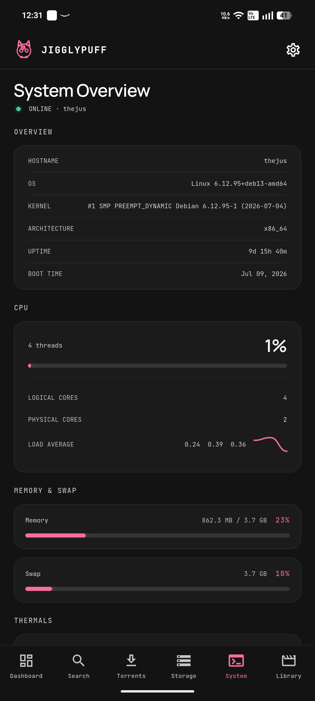
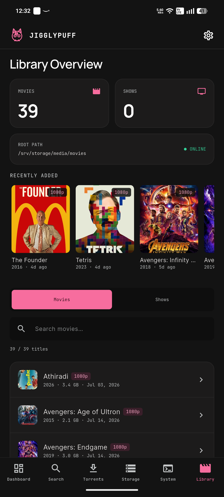
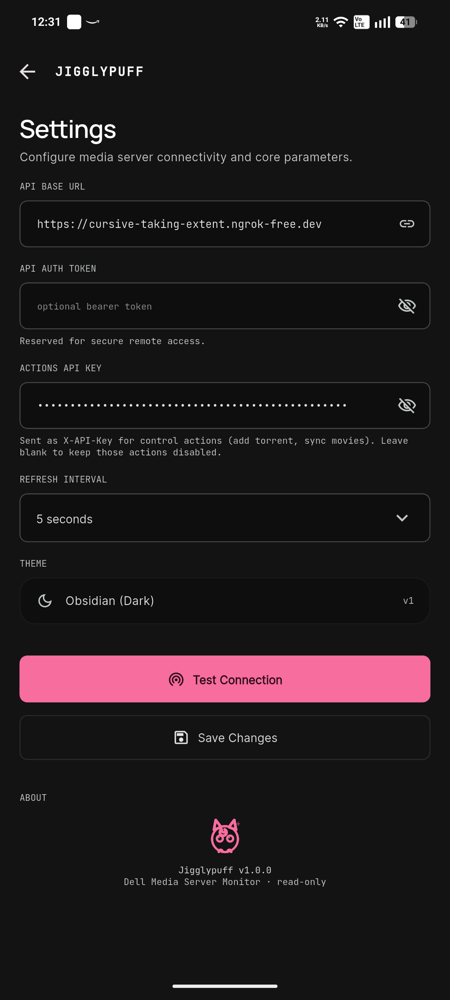
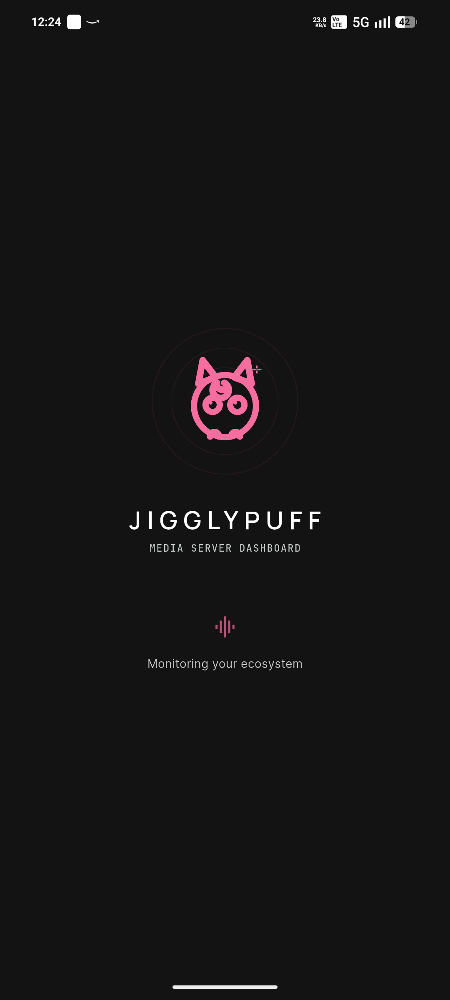

<div align="center">
  
</div>

---

# JigglyPuff

A **monitoring dashboard** for your self-hosted home media server, built with
**Flutter** for Android. It consumes the `media-server-api` FastAPI backend
(everything under `/api/v1`) and renders system health, storage, torrent
activity, library contents, and service status — with live auto-refresh, a
**real-time torrent WebSocket**, pull-to-refresh, and pink-branded "Deep
Obsidian" styling. It also has a **movie discovery search** (find a title →
pick a torrent → add straight to qBittorrent). The monitoring surface is
read-only; a small set of **authenticated control actions** (add torrent,
pause/resume/delete, sync movies) rounds it out.

> Looking for internal conventions, architecture rules, and what *not* to
> change without asking? See **`CLAUDE.md`** — this file is the product/API
> reference; that one is the contributor guide.

---

## Contents

- [Screenshots](#screenshots)
- [Run it](#run-it)
- [System architecture](#system-architecture)
- [How data flows: the polling engine](#how-data-flows-the-polling-engine)
- [The four UI states](#the-four-ui-states)
- [Every endpoint, in detail](#every-endpoint-in-detail)
- [Screens](#screens)
- [Design system](#design-system)
- [Extending toward v2 (control actions)](#extending-toward-v2-control-actions)
- [Tests](#tests)

---

## Screenshots

<p align="center">
  <br/>
  <em>Pink-branded, dark-first — a monitor for any self-hosted media server.</em>
</p>

| Dashboard | Search | Torrents |
|:---:|:---:|:---:|
|  |  |  |
| **Storage** | **System** | **Library** |
|  |  |  |
| **Settings** | **Splash** | |
|  |  | |

---

## Run it

Prerequisites: Flutter SDK (3.x), an Android device or emulator, and the
`media-server-api` backend reachable on your LAN.

```bash
cd jigglypuff
flutter pub get
flutter run            # with a device/emulator attached
```

Or install a build directly:

```bash
flutter build apk --debug
# → build/app/outputs/flutter-apk/app-debug.apk
```

### Point it at your server

1. Launch the app → tap the **⚙ gear** (top-right) → **Settings**.
2. Set **API Base URL** to your backend, e.g. `http://192.168.1.50:8000`
   (no trailing `/api/v1` — the client appends that automatically).
3. Optionally set **Refresh Interval** (5–60s; default 10s) — this drives every
   auto-refreshing screen from one place.
4. Optionally set **Actions API Key** — this is sent as `X-API-Key` and enables
   the control actions (add torrent / sync movies). It must match the server's
   `ACTIONS_API_KEY`. Leave it blank and those actions stay disabled (a tap
   just prompts you to add the key); the rest of the app works without it.
5. Tap **Test Connection** (hits `GET /api/v1/health`), then **Save Changes**.

The base URL, auth token, and refresh interval are persisted with
`SharedPreferences`, so they survive restarts and can be changed anytime — e.g.
switching between a LAN IP and a remote/VPN address.

> **Fonts / first launch:** Manrope, Inter and JetBrains Mono are fetched at
> runtime via `google_fonts` (cached after first load), so the very first
> launch needs internet. Everything else only talks to your configured server.
>
> **Cleartext HTTP:** the backend is plain `http://` by design (LAN-only v1),
> so `android:usesCleartextTraffic="true"` is set in the Android manifest and
> the `INTERNET` permission is declared.
>
> **Poster art caching:** library artwork loads via `cached_network_image` and
> is cached **on disk**, persisting across app restarts and revalidating via
> the server's `Cache-Control`/`ETag` headers.

---

## System architecture

JigglyPuff is a **pure client** — no local database, no business logic beyond
display formatting, and (in v1) no write operations. Every screen is a direct,
typed reflection of one backend JSON response, refreshed on a timer.

```
┌─────────────────────────────────────────────────────────────────┐
│  main.dart                                                       │
│  └─ loads AppConfig (SharedPreferences) → provides via Provider  │
│     └─ SplashScreen → RootShell (bottom-tab IndexedStack)        │
└─────────────────────────────────────────────────────────────────┘
                              │
        ┌─────────────────────┼──────────────────────┐
        ▼                     ▼                       ▼
   screens/*.dart       widgets/*.dart          theme/*.dart
   (one per tab,        (RingGauge, cards,       (Obsidian palette,
   built on              chips, states, the        pink accent, three
   PollingView<T>)        poster loader, ...)       typefaces)
        │
        ▼
┌───────────────────────────────────────────────────────────┐
│  data/polling_view.dart                                    │
│  PollController<T>  — fetch, re-fetch on a timer, keep      │
│                        previous data, pause in background   │
│  PollingView<T>      — loading/error UI + hands screens the │
│                        typed data once it's in              │
└───────────────────────────────────────────────────────────┘
        │
        ▼
┌───────────────────────────────────────────────────────────┐
│  api/endpoints.dart — MediaServerApi                        │
│  the ONLY file that knows route paths & query params         │
└───────────────────────────────────────────────────────────┘
        │
        ▼
┌───────────────────────────────────────────────────────────┐
│  api/api_client.dart — ApiClient                             │
│  builds {baseUrl}/api/v1{path}, attaches auth header,        │
│  10s timeout, JSON decode, converts every failure mode       │
│  into a typed ApiException                                   │
└───────────────────────────────────────────────────────────┘
        │
        ▼
      media-server-api (FastAPI backend, on your LAN)
```

**Layer responsibilities, top to bottom:**

| Layer | File(s) | Job |
|---|---|---|
| Screens | `screens/*.dart` | Layout + which endpoint(s) to poll + how to render degraded flags |
| Widgets | `widgets/*.dart` | Presentational, screen-agnostic (gauges, cards, chips, state panels) |
| Polling | `data/async_value.dart`, `data/polling_view.dart` | The "React Query" layer — fetch, cache-in-memory, auto-refresh, pull-to-refresh |
| Realtime | `data/torrent_stream.dart` | WebSocket live torrents with REST fallback + reconnect, same `AsyncValue` contract |
| Routes | `api/endpoints.dart` | Typed method per backend route (GET, `POST /actions/*`, WS URL); the only place a path is written |
| Transport | `api/api_client.dart` | HTTP GET + POST(json/multipart), base URL + query building, timeouts, `X-API-Key`, error typing |
| Models | `api/models.dart` | One class per response shape, defensive `fromJson` parsing |
| Config | `config.dart` | Base URL / auth token / refresh interval, persisted, injected via `provider` |

No layer skips another: a screen never calls `ApiClient` directly, and
`ApiClient` never knows a route path (that's `endpoints.dart`'s job). This
keeps every future backend change (see `CLAUDE.md` → "source of truth") to a
two-file edit: add the field to `models.dart`, and if it's a new route, add a
method to `endpoints.dart`.

---

## How data flows: the polling engine

There's no Redux/Bloc/Riverpod — **the polling engine's in-memory state *is*
the app's state**, same philosophy as React Query in the original spec this
app was built from.

1. A screen wraps its content in `PollingView<T>(fetch: (api) =>
   api.dashboard(), builder: (context, data, controller) => ...)`.
2. `PollingView` creates a `PollController<T>`, which:
   - fetches immediately on construction,
   - re-fetches every `AppConfig.refreshInterval` (or a per-view override) via
     `Timer.periodic`,
   - **keeps the last successful data visible during a refetch** (`AsyncValue`
     tracks `isRefreshing` vs `isInitialLoading`), so a gauge doesn't flicker
     back to a spinner every 10 seconds,
   - **pauses the timer when the app is backgrounded** and immediately
     refetches on resume (`WidgetsBindingObserver`),
   - **guards against races** with a monotonic request id, so a slow response
     to an old request can't clobber a newer one.
3. If the user edits the base URL, auth token, or refresh interval in
   Settings, every currently-mounted `PollingView` notices via
   `context.watch<AppConfig>()`, disposes its old controller, and starts a
   fresh one against the new config — no app restart needed.
4. Pull-to-refresh (`RefreshIndicator` inside `RefreshableBody`) just calls
   `controller.refresh()` directly.

**What the polling engine does *not* do:** decide whether a response is
"degraded." It only distinguishes *transport* success (got a `200` with valid
JSON) from *transport* failure (timeout / non-2xx / bad JSON → `ApiException`
→ `ErrorState`). Whether the payload itself signals a subsystem outage
(`reachable: false`, etc.) is entirely up to the screen — see below.

**Real-time variant.** The Torrents list uses `data/torrent_stream.dart`
instead of the poller: `TorrentStreamController` opens the `/torrents/ws`
WebSocket for ~2s live snapshots, but exposes the *same* `AsyncValue<TorrentList>`
+ `refresh()` contract and **falls back to REST polling with backoff reconnect**
if the socket is unavailable — so the screen behaves identically whether the
transport is a socket or a poller, and works against backends that don't serve
`/ws`.

---

## The four UI states

Every data-driven screen in this app renders exactly one of these at a time,
and the distinction between **error** and **degraded** is the single most
important design decision in the codebase — it comes directly from the
backend's contract (see next section):

| State | Trigger | Widget | Meaning |
|---|---|---|---|
| **Loading** | No data yet, first fetch in flight | `LoadingState` | Spinner + label |
| **Error** | Backend unreachable, timed out, or returned non-2xx/bad JSON | `ErrorState` | The *server itself* is down. Shows a synthetic `ERR_CODE`, optional HTTP status, and a retry button. |
| **Degraded** | Backend responded `200`, but a subsystem flag inside the payload is false (`reachable: false`, `available: false`, `exists: false`) | `DegradedState` | The server is fine; one dependency isn't (qBittorrent offline, SMART unavailable, a library path missing). Amber/red inline card with the server's own `message`, not a full-screen error. |
| **Success** | Backend responded `200` and the relevant subsystem flags are all healthy | The real screen content | — |

This matters because the backend was deliberately designed to **never throw an
HTTP error for a down subsystem** — it always returns `200` with a flag. If the
client mistakenly treated `reachable: false` as an exception, every screen
would show a scary full-page error every time qBittorrent restarts, which is
exactly the failure mode this design avoids.

---

## Every endpoint, in detail

All paths are relative to `{baseUrl}/api/v1`. All are `GET`. No auth is
required in v1 (an `Authorization: Bearer <token>` header is sent automatically
whenever a token is configured in Settings, ready for v2).

### `GET /health`

**Purpose:** liveness check. Used by Settings' "Test Connection" button and
implicitly proves the base URL is reachable.

**Response**
```jsonc
{ "status": "ok", "version": "1.0.0", "time": "2026-07-09T16:04:11+00:00" }
```

**Model:** `Health` (`api/models.dart`) — `status`, `version`, `time`, plus a
computed `isOk` (`status == "ok"`). No degraded state; either it answers or the
request fails.

**Consumers:** `screens/settings_screen.dart` only.

---

### `GET /dashboard`

**Purpose:** the home-tab snapshot — everything needed for an at-a-glance view
in one round trip.

**Response**
```jsonc
{
  "hostname": "dell-server",
  "server_name": "Home Media Server",
  "uptime_seconds": 3589,
  "uptime_human": "59m",
  "cpu_percent": 4.2,
  "memory_percent": 35.1,
  "disk_percent_used": 61.0,
  "storage": {
    "primary_path": "/srv/storage",
    "total_human": "3.6 TB", "used_human": "2.2 TB", "free_human": "1.4 TB",
    "percent_used": 61.0
  },
  "torrents_active": 3, "torrents_downloading": 1, "torrents_seeding": 2,
  "torrents_reachable": true,
  "movies_count": 214, "shows_count": 37,
  "services": [
    { "name": "jellyfin", "active": true, "state": "active", "sub_state": "running", "enabled": true }
  ],
  "generated_at_iso": "2026-07-09T16:04:11+00:00"
}
```

**Model:** `Dashboard`, embedding `StorageBrief` and a `List<ServiceInfo>`.

**Degraded signal:** `torrents_reachable: false` — the Dashboard renders its
torrents card at reduced opacity and shows a "qBittorrent Offline"
`DegradedState` card below the main grid. There is no "backend down" flag here
because if the backend itself were down, the whole request would fail
transport-level (→ `ErrorState`) rather than returning this shape.

**Consumers:** `screens/dashboard_screen.dart` (polled at the global refresh
interval). CPU/memory drive `RingGauge`s; `storage.percent_used` drives a
`ProgressBar`; `services` drives `ServiceChips`; `movies_count`/`shows_count`
render as a small two-column count card.

---

### `GET /torrents/summary`

**Purpose:** aggregate torrent-client stats — counts by state + total transfer
speed — separate from the full list so the header can refresh independently
of (and faster than) a potentially long torrent list.

**Response**
```jsonc
{
  "reachable": true,
  "total": 5, "downloading": 1, "seeding": 2, "completed": 4, "paused": 0, "error": 0,
  "total_dlspeed_bytes": 1048576, "total_upspeed_bytes": 524288,
  "total_dlspeed_human": "1.0 MB/s", "total_upspeed_human": "512.0 KB/s",
  "message": null,
  "client_name": "qBittorrent", "client_version": "4.5.2", "node": null
}
```

**Model:** `TorrentsSummary`, with a computed `clientLabel` getter that joins
`client_name` / `v{client_version}` / `node` with " · " (skipping any that are
null/empty) — e.g. `"qBittorrent · v4.5.2"`.

**Degraded signal:** `reachable: false` (+ `message` explaining why) — the
Torrents screen shows a `DegradedState` titled "qBittorrent is Offline" in
place of the stat cards, and the subtitle under the screen title reads "Client
offline" instead of the client label.

**Consumers:** `screens/torrents_screen.dart`'s `_TorrentsHeader`, which — from
this single fetch — renders the client-identity subtitle, the (v2-stub)
Add Magnet / Start All buttons, four stat cards (Total/Downloading/Seeding/
Completed), and the aggregate up/down speed row.

---

### `GET /torrents/list?state=`

**Purpose:** the actual torrent rows, optionally filtered.

**Query params:** `state` (optional) — one of `downloading`, `seeding`,
`completed`. Omitted = all torrents.

**Response**
```jsonc
{
  "reachable": true, "count": 1, "message": null,
  "torrents": [
    {
      "hash": "abc123", "name": "Some.Movie.2024", "state": "downloading",
      "category": "movies", "progress": 0.42, "progress_percent": 42.0,
      "size_bytes": 5368709120, "size_human": "5.0 GB",
      "downloaded_bytes": 2254857830,
      "dlspeed_bytes": 1048576, "upspeed_bytes": 0,
      "dlspeed_human": "1.0 MB/s", "upspeed_human": "0 B/s",
      "eta_seconds": 2960, "eta_human": "49m",
      "ratio": 0.1, "num_seeds": 12, "num_leechs": 3,
      "added_on_iso": "2026-07-09T10:00:00+00:00"
    }
  ]
}
```

**Model:** `TorrentList` (wraps `reachable`/`count`/`message` + a
`List<Torrent>`).

**Degraded signal:** same `reachable`/`message` pattern as `/torrents/summary`
— the list re-fetches every time the filter segment changes (the screen keys
`PollingView` on the selected filter so switching tabs issues a fresh request
with the new `state` param).

**Consumers:** `screens/torrents_screen.dart`'s main body — each `Torrent`
renders as a card with a state badge, a `ProgressBar` driven by
`progress_percent`, `dlspeed_human`/`upspeed_human` (displayed verbatim), and
`eta_human` when downloading. **Note:** the screen doesn't poll this endpoint
directly — it uses the WebSocket below and falls back to this REST route only
when the socket is unavailable.

---

### `GET /torrents/ws` (WebSocket)

**Purpose:** pushes a full `TorrentList` snapshot (identical shape to
`/torrents/list`) about every 2 seconds, for a live torrents view without
polling. Supports the same optional `?state=` filter. No auth. Each message is
a complete snapshot — there's no incremental diffing or backfill, so a dropped
connection just reconnects and resumes with the next full frame.

**Consumer:** `data/torrent_stream.dart` → `TorrentStreamController`, wrapped by
`TorrentStreamView` (a `PollingView`-shaped widget). On mount it seeds
instantly with one REST `/torrents/list` fetch, then connects the socket; if
the socket can't connect or drops, it **falls back to REST polling** at the
configured refresh interval and keeps retrying the socket with exponential
backoff. The Torrents screen shows a green **LIVE** badge while the socket is
actively delivering. This means the screen works against a backend that
doesn't (yet) serve `/ws` — it just runs as a poller.

---

### `POST /actions/torrents`, `/actions/torrents/file`, `/actions/sync-movies` (control actions)

**Purpose:** the only write operations in the app. All three require an
`X-API-Key` header matching the server's `ACTIONS_API_KEY`.

| Endpoint | Body | Does |
|---|---|---|
| `POST /actions/torrents` | JSON `{"url": "magnet:?…"}` | Add a torrent by magnet link or `.torrent` URL |
| `POST /actions/torrents/file` | `multipart/form-data`, field `file` | Add a torrent by uploading a `.torrent` file |
| `POST /actions/torrents/pause` | JSON `{"hash": "<hash>"}` | Pause a torrent (stays in the list, resumable) |
| `POST /actions/torrents/resume` | JSON `{"hash": "<hash>"}` | Resume a paused torrent |
| `POST /actions/torrents/delete` | JSON `{"hash": "<hash>"}` | Remove a torrent **and delete its files on disk** (destructive) |
| `POST /actions/sync-movies` | (none) | Move completed downloads into the movies library + clear their torrent entries |

**Response** (`ActionResult` model):
```jsonc
{ "ok": true, "message": null }                             // add / pause / resume / delete
{ "ok": true, "exit_code": 0, "output": "…", "message": null,
  "moved": ["Ted (2012)"], "skipped": ["Vanilla Sky"],
  "torrents_removed": 2 }                                    // sync-movies
```
`ActionResult.syncSummary` renders the last three as e.g. "Moved 1 · skipped 1
· removed 2 torrents" — the app shows that instead of parsing `output`.

**Two failure modes, handled differently:**
- **Soft failure** — HTTP `200` with `{"ok": false, "message": "<reason>"}`
  (e.g. qBittorrent briefly unreachable). Surfaced as a toast, *not* a
  full-screen error, consistent with the rest of this API's "a down subsystem
  isn't an exception" philosophy.
- **Auth/config failure** — `401` (key wrong/missing) or `503` (server has no
  key configured). Both map to a single "control actions unavailable — check
  the API key in Settings" message.

**Consumers:** `screens/torrents_screen.dart`:
- Header **Add Torrent** → sheet (paste magnet/URL → `addTorrentUrl`, or pick a
  `.torrent` via `file_picker` → `addTorrentFile`).
- Header **Sync Movies** → confirm → `syncMovies` → a result dialog showing the
  `moved`/`skipped`/`torrents_removed` breakdown.
- Each torrent row's **⋮ menu** → Pause/Resume (state-aware) and Delete
  (`deleteTorrent`, behind a destructive confirmation since it removes files).
  After an action the live socket pushes an updated snapshot within ~2s.

All routed through one `_run()` helper that gates on a configured key and maps
the failure modes above. POSTs use a longer `AppConfig.actionTimeout` (3 min)
since sync-movies moves files.

---

### `GET /storage/summary?folder_sizes=`

**Purpose:** disk usage, top-level folder sizes, and SMART health in one call.

**Query params:** `folder_sizes` (bool, default `true` in the app's calls) —
skips per-folder size computation when `false`, for speed. Toggleable live in
the Storage screen.

**Response**
```jsonc
{
  "disks": [
    { "path": "/srv/storage", "exists": true,
      "total_bytes": 0, "used_bytes": 0, "free_bytes": 0, "percent_used": 61.0,
      "total_human": "3.6 TB", "used_human": "2.2 TB", "free_human": "1.4 TB" }
  ],
  "folders": [
    { "path": "/srv/storage/media/movies", "exists": true,
      "size_bytes": 0, "size_human": "1.8 TB", "entry_count": 214 }
  ],
  "smart": {
    "available": true, "device": "/dev/sda", "healthy": true,
    "status": "PASSED", "temperature_celsius": 38,
    "power_on_hours": 8123, "message": null
  }
}
```

**Models:** `StorageSummary` embedding `List<DiskInfo>`, `List<FolderInfo>`,
and one `SmartInfo`.

**Degraded signals (three independent ones in a single response):**
- Per-disk `exists: false` → that disk renders as a "path not found" card
  instead of a usage gauge.
- `smart.available: false` → the whole SMART card collapses to a muted "SMART
  unavailable" row with the server's `message` (no root access / not
  configured is expected, not an error).
- An empty `folders` array (when `folder_sizes=false`) → shows "Folder sizing
  disabled" instead of an empty list.

**Consumers:** `screens/storage_screen.dart`. Per-volume disk cards use
**classic green→amber→red** health coloring (`ProgressBar(..., brand: false)`)
rather than the app's pink brand color, because these are genuine
health/capacity indicators, not "nominal activity" gauges.

---

### `GET /system/overview`

**Purpose:** deep host detail — OS/kernel/uptime, CPU, memory/swap,
temperatures, battery, network interfaces.

**Response** (fields beyond `temperatures`/`battery`/`load_average`/
`interfaces` are always present; those four may be empty/null)
```jsonc
{
  "hostname": "dell-server", "os": "Ubuntu 22.04", "kernel": "5.15.0",
  "architecture": "x86_64",
  "uptime_seconds": 1036800, "uptime_human": "12d 4h",
  "boot_time_iso": "2026-06-27T07:14:00+00:00",
  "cpu_percent": 14.0, "cpu_count_logical": 16, "cpu_count_physical": 8,
  "load_average": { "one": 0.45, "five": 0.52, "fifteen": 0.48 },
  "memory": { "total_bytes": 0, "used_bytes": 0, "available_bytes": 0,
              "percent": 68.0, "total_human": "16.0 GB", "used_human": "10.9 GB" },
  "swap": { "total_bytes": 0, "used_bytes": 0, "percent": 30.0, "total_human": "4.0 GB" },
  "temperatures": [
    { "label": "Core 0", "current_celsius": 42.0, "high_celsius": 80.0, "critical_celsius": 95.0 }
  ],
  "battery": null,
  "interfaces": [
    { "name": "eth0", "addresses": ["192.168.1.50"] }
  ]
}
```

**Models:** `SystemOverview` embedding `LoadAverage?`, `MemoryInfo`,
`SwapInfo`, `List<TemperatureInfo>`, `BatteryInfo?`, `List<NetInterface>`.

**Degraded signal:** none in the "reachable/available" sense — this endpoint
either answers (transport success → render what's present) or fails transport
(→ `ErrorState`). The "degradation" here is purely **optionality**:
`temperatures`, `battery`, `load_average`, and `interfaces` sections are each
hidden entirely (not shown as empty/error) when null or empty, since a
headless server has no battery and a VM may report no thermal sensors.

**Consumers:** `screens/system_screen.dart`. `cpu_percent` drives a
`RingGauge`; `load_average` (when present) renders next to a small
`Sparkline`; each `TemperatureInfo` is colored via `levelForTemp(current,
high: highCelsius, critical: criticalCelsius)` rather than a fixed threshold,
since sensors report their own limits.

---

### `GET /library/summary`

**Purpose:** counts + a "recently added" strip for the Library tab's overview
section, without paying for a full listing.

**Response**
```jsonc
{
  "movies_count": 214, "shows_count": 37,
  "movies_root": "/srv/storage/media/movies", "shows_root": "/srv/storage/media/shows",
  "movies_exists": true, "shows_exists": true,
  "recently_added": [
    { "name": "Some Movie (2024)", "path": "...", "is_dir": true,
      "size_bytes": 0, "size_human": "0 B", "modified_iso": "2026-07-08T...",
      "poster_url": "/api/v1/library/artwork?id=a1b2c3d4&size=poster",
      "thumb_url": "/api/v1/library/artwork?id=a1b2c3d4&size=thumb",
      "year": 2024, "quality": "2160p", "hdr": true, "jellyfin_id": "a1b2c3d4" }
  ]
}
```

**Model:** `LibrarySummary` embedding `List<LibraryItem>` for
`recently_added`. `LibraryItem`'s artwork/metadata fields
(`poster_url`/`thumb_url`/`year`/`quality`/`hdr`/`jellyfin_id`) are all
optional — see the artwork section below.

**Degraded signal:** `movies_exists`/`shows_exists: false` (independently) →
the corresponding count card shows a warning dot instead of a healthy one, and
the root-path card flips from "ONLINE" to "CHECK".

**Consumers:** `screens/library_screen.dart`'s `_LibrarySummary` — two count
cards, a root-path status card, and (when non-empty) a horizontally-scrolling
poster strip using `PosterImage` for each recently-added item.

---

### `GET /library/movies?sizes=` and `GET /library/shows?sizes=`

**Purpose:** the full listing for each category.

**Query params:** `sizes` (bool) — when `false`, every item's `size_bytes` is
`0`/`size_human` is `"0 B"` (fast path, no per-file stat calls). The Library
screen always requests `sizes=true` so per-title sizes are shown.

**Response**
```jsonc
{
  "category": "movies", "root": "/srv/storage/media/movies", "exists": true,
  "count": 214,
  "items": [ /* same LibraryItem shape as recently_added above */ ]
}
```

**Model:** `LibraryList` (`category`, `root`, `exists`, `count`,
`List<LibraryItem>`).

**Degraded signal:** `exists: false` → the screen shows a `DegradedState`
("movies path not found") instead of the list.

**Consumers:** `screens/library_screen.dart` main body. A movies/shows
segmented toggle picks which of the two endpoints is polled (re-fetches on
toggle via a `ValueKey` on `PollingView`); a client-side search box filters the
already-loaded `items` by name (no server round trip per keystroke).

**Artwork fields, in detail:** `poster_url`/`thumb_url` are relative paths
(under `/api/v1/library/artwork?...`) or `null` when no art exists for that
title. The app resolves them against the base URL
(`AppConfig.resolveUrl`) and loads them with `PosterImage`, which falls back to
a pink-gradient placeholder for `null`, while loading, or on any fetch error —
never treating a missing poster as an error state. `year`/`quality`/`hdr` are
shown as small badges; when the backend hasn't populated them yet, `MediaTitle`
(`utils/media_title.dart`) parses the same info out of the raw folder name as a
fallback, but real backend values always win when present.

**Movie name/year are Jellyfin-sourced (when matched).** For movies, once
Jellyfin has scanned a title, `name`/`year` switch from the raw filename to the
clean metadata (`Ayan.2009.1080p…mkv` → `Ayan`, `2009`); until then they're the
filename-derived values. The app displays `name` directly, so this "just gets
cleaner" — and it never keys any cache/match on `name` (poster caching is keyed
on the artwork `url`, which is id/path-based), so a name changing after a scan
causes no stale/duplicate state. Shows are unaffected this round.

---

### `GET /movies/search?q=` and `GET /movies/torrents?title=`

**Purpose:** the Search tab. `movies/search` is a TMDB-backed title search;
`movies/torrents` returns downloadable sources for a chosen title.

**Search response**
```jsonc
{
  "success": true, "status": 200,
  "results": [
    { "id": 10033, "title": "Just Friends", "year": "2005", "language": "en",
      "rating": 6.204, "overview": "…", "thumbnail": "https://image.tmdb.org/t/p/w342/….jpg" }
  ]
}
```

**Torrents response** (rendered sorted highest-seeds-first)
```jsonc
{
  "success": true, "status": 200,
  "results": [
    { "title": "Just Friends (2005) 720p BrRip x264", "seeds": 23, "peers": 1,
      "bytes": 629795717, "magnetUrl": "magnet:…", "hash": "…", "source": "YTS" }
  ]
}
```

**Models:** `MovieSearchResult`/`MovieSearchResponse` and
`MovieTorrent`/`MovieTorrentsResponse`. `MovieTorrent` derives `sizeHuman`
(from raw `bytes`) and `qualityTags` (720p/1080p/BluRay/WEBRip… inferred from
the title); `MovieTorrentsResponse.fromJson` sorts by `seeds` descending.

**Consumers:** `screens/search_screen.dart` (debounced search) and
`widgets/torrent_sheet.dart` (the torrent bottom sheet). Tapping a torrent's
**Add to qBittorrent** button feeds its `magnetUrl` into the existing
`addTorrentUrl` control action — no separate download path.

---

### `GET /services`

**Purpose:** a standalone systemd-style service list. (Note: the Dashboard
already embeds `services[]` inline — this endpoint exists for a
services-specific view but is not currently polled by any screen; the model
(`ServicesResponse`) and endpoint method (`MediaServerApi.services()`) exist
and are ready to use if a dedicated Services screen is added later.)

**Response**
```jsonc
{
  "available": true, "message": null,
  "services": [
    { "name": "jellyfin", "active": true, "state": "active", "sub_state": "running", "enabled": true }
  ]
}
```

**Model:** `ServicesResponse` (`available`, `message`, `List<ServiceInfo>`).

---

### `GET /library/artwork?id=|path=&size=poster|thumb`

**Purpose:** streams the actual poster/thumbnail image bytes. The app never
constructs this URL itself — it always uses whatever `poster_url`/`thumb_url`
a `LibraryItem` provides (the backend decides whether to key by `id` or
`path`). Documented here for completeness since `PosterImage` depends on its
behavior: `Cache-Control`/`ETag` headers for revalidation, `404` (not `500`)
when art is missing.

---

## Screens

| Tab | Endpoint(s) polled | Refresh | Notes |
|---|---|---|---|
| **Dashboard** | `GET /dashboard` | global interval | Home tab. CPU/Memory ring gauges, storage bar, service chips, torrents + library snapshot cards, "online" status strip. |
| **Torrents** | `GET /torrents/ws` (list, live) + REST fallback; `GET /torrents/summary` (header); `POST /actions/*` (buttons + row ⋮ menu) | real-time (~2s) for the list; global interval for the header | Segmented filter; per-torrent progress + speed; **LIVE** badge; Add Torrent (paste link / pick file), Sync Movies, and per-row Pause/Resume/Delete. |
| **Storage** | `GET /storage/summary?folder_sizes=` | global interval | Per-disk usage cards (health-colored), folder-size list, SMART card; folder-sizes toggle. |
| **System** | `GET /system/overview` | global interval | Overview, CPU + load-average sparkline, memory/swap bars, thermals/battery/network (only rendered when present). |
| **Library** | `GET /library/summary`, `GET /library/movies\|shows?sizes=true` | once per load (`Duration.zero` — no continuous polling; pull-to-refresh still works) | Counts + recently-added poster strip, movies/shows toggle, client-side search, per-title sizes, real poster art via `PosterImage`. |
| **Search** | `GET /movies/search?q=`, `GET /movies/torrents?title=`, `POST /actions/torrents` (download) | on-demand (debounced) | Debounced (350ms, min 2 chars, cancels stale) movie search with skeleton loaders; tap a result → torrent bottom sheet (sorted by seeds, quality chips) → Add to qBittorrent. |
| **Settings** | `GET /health` (on demand) | — | Base URL, auth token, **actions API key**, refresh interval, Test Connection. Reached from the app-bar gear, not a tab. |
| **Splash** | none | — | Branded launch screen (mascot + wordmark), auto-advances to the tab shell after ~1.9s. |

---

## Design system

- **Palette:** "Deep Obsidian" dark theme (near-black tonal-elevation
  surfaces) with a **JigglyPuff pink** brand accent (`theme/colors.dart` →
  `AppColors.accent`). Pink is used for nominal-load gauges/bars, primary
  buttons, active nav, and brand chrome. **Green/amber/red are reserved for
  literal health status** (services up/down, SMART pass/fail, connectivity,
  and per-volume storage capacity) — see `barColor()`/`levelForPercent()`/
  `levelForTemp()`.
- **Typography:** three typefaces mirroring the original Stitch design intent
  — **Manrope** for headlines/big metrics (a `google_fonts`-registry stand-in
  for the originally-specified "Geist," which isn't available in the
  package), **Inter** for body copy, **JetBrains Mono** for technical
  labels/timestamps/status text.
- **Components:** `RingGauge` (glowing circular gauge), `ProgressBar` (slim
  linear bar), `StatusChip`/`StatusDot` (pill + pulsing dot), `GlassCard`/
  `StatCard`/`Section` (tonal-elevation surfaces, no drop shadows), the four
  state widgets (`LoadingState`/`ErrorState`/`DegradedState`/`EmptyState`),
  `Shimmer`/`SkeletonBox` (search loaders), `AnimatedSegmented` (sliding-pill
  filters), and `JigglyLogo` — a hand-painted `CustomPainter` mascot used
  in-app.
- **Launcher icon:** generated from `assets/jigglypuff.jpg` via
  `flutter_launcher_icons` (config in `pubspec.yaml`; adaptive icon uses a
  mascot-cropped foreground over black). Regenerate with
  `dart run flutter_launcher_icons`.

---

## Control actions & extending further

The monitoring surface is read-only, but the app now performs three
authenticated control actions (add torrent by link/file, sync movies) — see the
`POST /actions/*` section above. Adding more later is a localized change:

- **`api/endpoints.dart`** is the only file that knows route paths — add new
  `POST` methods (pause/resume a torrent, restart a service, reboot) here.
- **`ApiClient.postJson` / `postMultipart`** already attach both
  `Authorization: Bearer <token>` and `X-API-Key`, use the longer action
  timeout, and normalize `401`/`503`. New actions get that for free.
- **The `_run()` helper in `torrents_screen.dart`** is the template for any new
  control UI: require a key, show a progress toast, surface `ok:false` softly,
  and route auth failures to Settings.
- **Row widgets leave action slots**: `ServiceRow` accepts an optional `action`
  widget for a per-service restart/enable control.

**Not yet wired:** registering as an Android share target (sharing a link or
`.torrent` *into* the app from another app's share sheet). The same actions are
reachable in-app today (paste URL / pick file); OS-level share receiving would
need `receive_sharing_intent` + manifest intent-filters.

---

## Tests

```bash
flutter analyze   # must be clean
flutter test      # model-parsing unit tests + the MediaTitle filename parser
flutter build apk --debug   # confirms it actually compiles for Android
```

Test coverage focuses on the pure, backend-independent client logic: defensive
JSON parsing (including the "degraded flags parse as data, not exceptions"
contract and `ActionResult`), the `MediaTitle` filename-metadata fallback
parser, and `AppConfig` URL derivation (`torrentsWsUri`, `resolveUrl`,
`actionHeader`). The WebSocket stream and the `POST /actions/*` calls need a
live backend and aren't unit-tested — verify those by running the app against a
real (or stubbed) server, checking the LIVE badge appears, the socket→REST
fallback works when `/ws` is down, and control actions handle the
missing-key / `ok:false` / `401`/`503` cases.
